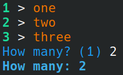

# PromptWithOptions

Command line input with options for Python

### Example

```python
from promptwithoptions import (
    set_prompt_defaults,
    promptwithoptions,
)

clr_yellow = "\u001b[33m"
clr_l_green = "\u001b[32;1m"
clr_blue = "\u001b[34m"
clr_l_blue = "\u001b[34;1m"

my_options = ('one', 'two', 'three')

set_prompt_defaults(options_line_color=clr_yellow, options_number_color=clr_l_green, input_line_color=clr_blue, confirm_line_color=clr_l_blue)

promptwithoptions('How many', my_options, default=1, show_confirmation=True)
```



### Available settings

These are all optional named arguments (in this order) of `set_prompt_defaults` and `promptwithoptions`.

`options`: list of available options, without this 

`data_type`: a callable that raises an exception if the input is invalid (e.g. `int`, `bool`)

`default`: default in case of empty input

`allow_empty`: boolean, if True then prompt doesn't repeat with empty input 

`allow_multiple`: boolean, if True then comma-separated values are accepted

`show_confirmation`: boolean, if True then the accepted input is reprinted with the selected option (if options are given)

`hide_key`: boolean, if True the first item of each option doesn't get printed on the screen

`hide_questionmark`: boolean, if True then '?' is not attached to prompt text (neither a ':' to the confirmation if shown)

`no_interaction`: boolean, if True default is applied automatically (if given) and no input is required (this is to apply `--yes`)

`options_line_color`: if given, options are displayed as a numbered list - this is the colour of the list items

`options_number_color`: if given, options are displayed as a numbered list - this is the colour of the numbers

`input_line_color`: as is

`confirm_line_color`: as is

### Setting and resetting defaults

`set_prompt_defaults()` can be called multiple times.  
A default value can be removed (set back to None) when explicitely given like `set_prompt_defaults(allow_empty=None)`.
If need argument defaults can be reset by calling `reset_defaults` (`from promptwithoptions import reset_defaults`).

### Options list

It's a plain list of strings, a list of keys and values or a dict.  
If there are keys and values only a key is returned at the end. In that case keys can be stopped from printing by `hide_key`.

### Entering empty value when default is given

Use '-' to explicitely get empty even when default is given and `allow_empty=True`.
